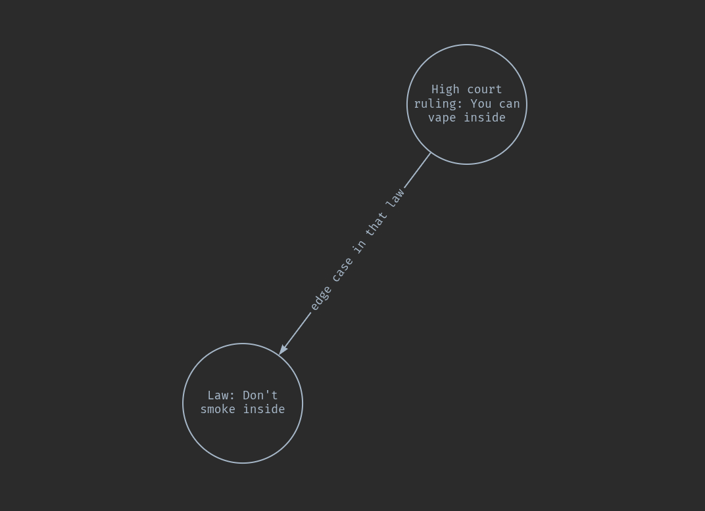
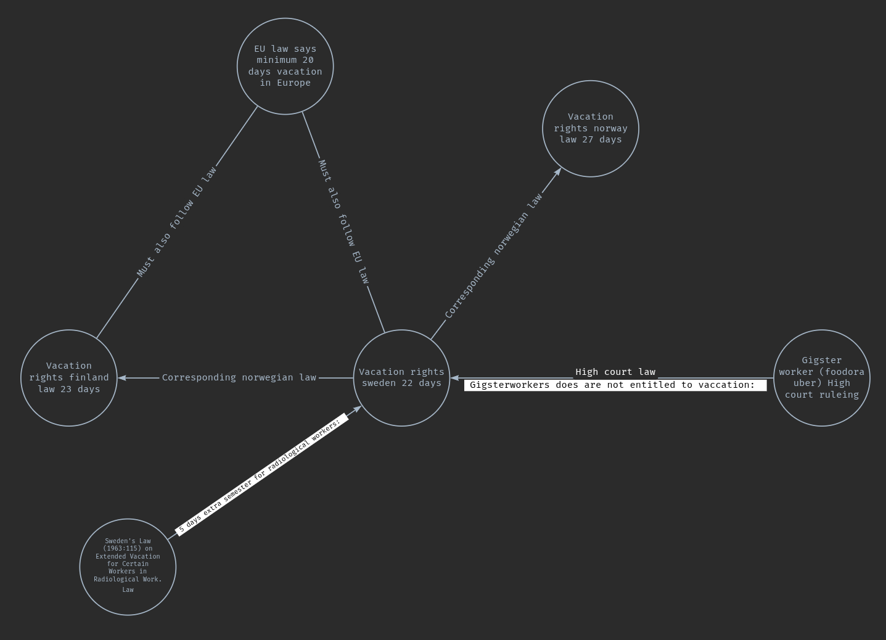

# Legal Knowledge Graph

Hello in apptempt to make my work more transparent im going to share my progress here. This is a project im currently working on.

so in very simple Sudo law what im trying to do is like the follwoing images say.

The fist image is here to show that data of what is connected is stored in diffrent places for example the law and a high court ruling case that is connected to the law.

This image is more to demonstrate the idea of the graph. Where you can connect diffrent laws to foregin laws, such as European Union law and other laws. So for example you want to draft a legal document. It can find the corresponding laws and terms for example vaction rights in the other country. 

Also connect diffrent high court rulings to those laws to check for legal edge cases. The gigster examples is just to make it easy. An LLM (or agent what ever) can then dig deeper for example a gigster in not classified as an employee in sweden. Then connect classifications of what an employee is in sweden. etc.

We also have other laws that effect vaccation right such as laws for radiological workers or military workers in sweden.

we also have paragraphs on the law with its own connections to diffrent contexts.

you also laws that are changes to the old laws. [like this law](https://www.lagboken.se/lagboken/start/arbetsratt-och-arbetsmiljoratt/semesterlag-1977480/d_1851956-sfs-2013_950-lag-om-andring-i-semesterlagen-1977_480/) on this law [here](https://www.lagboken.se/lagboken/lagar-och-forordningar/lagar-och-forordningar/rattsvasende/rattegang-och-annan-process/rattegangsregler/gallande/d_889-lag-1974_371-om-rattegangen-i-arbetstvister/)

### Important Note

- The reality is much more complex here. 

TODO:
- [ ] Right now im just scraping legal documents.